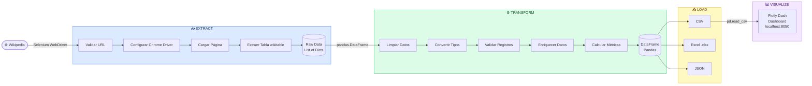
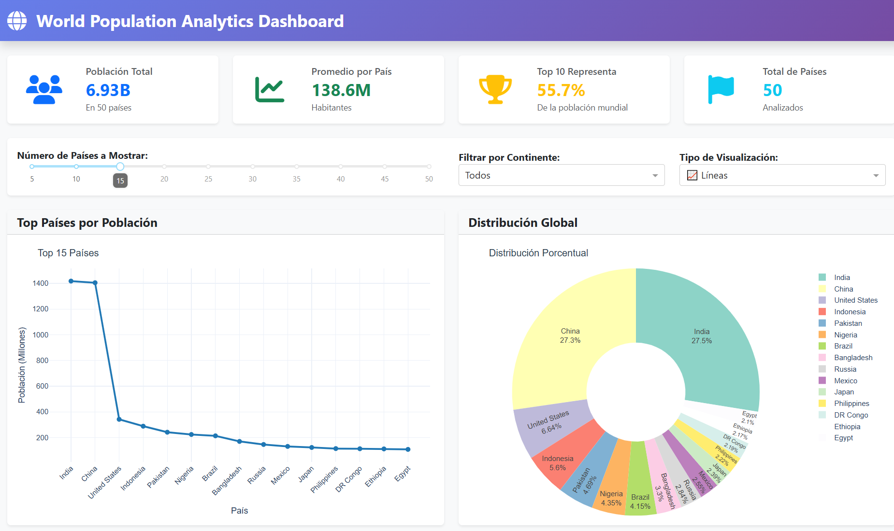
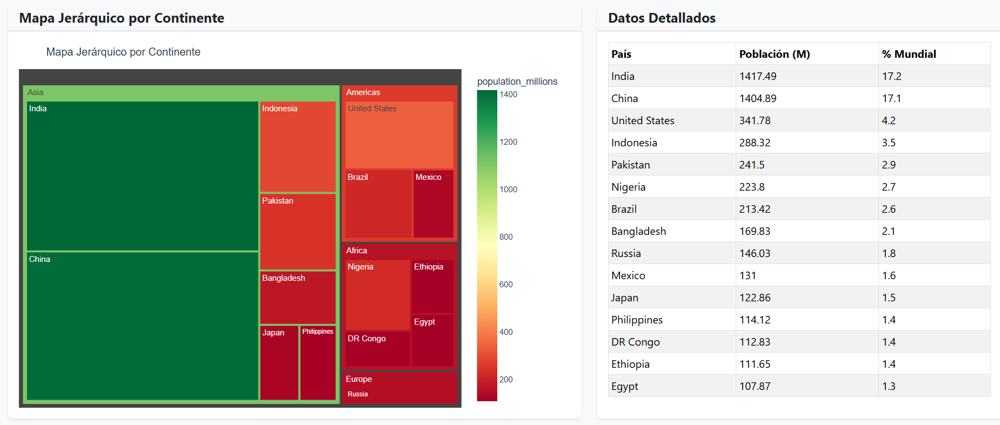

# 🌍 ETL Web Scraping — World Population Data

<div align="center">


**Pipeline ETL completo que extrae datos de población mundial desde Wikipedia,
los transforma con Pandas y los visualiza en un dashboard interactivo con Plotly Dash.**

[Ver Repositorio](https://github.com/jersonarrelucea14/ETL_Web_Scrapping) · [Reportar Bug](https://github.com/jersonarrelucea14/ETL_Web_Scrapping/issues) · [Solicitar Feature](https://github.com/jersonarrelucea14/ETL_Web_Scrapping/issues)

</div>

---

## 📋 Tabla de Contenidos

- [✨ Características](#-características)
- [🏗️ Arquitectura del Pipeline](#️-arquitectura-del-pipeline)
- [⚙️ Requisitos](#️-requisitos)
- [🚀 Instalación](#-instalación)
- [▶️ Uso](#️-uso)
- [🗄️ Estructura de Datos](#️-estructura-de-datos)
- [📊 Visualizaciones](#-visualizaciones)
- [📁 Estructura del Proyecto](#-estructura-del-proyecto)
- [💡 Ejemplos de Uso](#-ejemplos-de-uso)
- [📄 Licencia](#-licencia)
- [📬 Contacto](#-contacto)

---

## ✨ Características

- 🔍 **Web Scraping con Selenium** — Extracción automática desde Wikipedia con manejo de errores y rate limiting
- 🧹 **Transformación robusta** — Limpieza, normalización, validación y categorización de datos con Pandas
- 💾 **Exportación múltiple** — Genera archivos CSV, Excel (.xlsx) y JSON automáticamente
- 📊 **Dashboard interactivo** — Visualizaciones dinámicas con filtros en tiempo real usando Plotly Dash
- 📝 **Logging comprehensivo** — Registro detallado de cada fase del pipeline
- 🛡️ **Validación de seguridad** — Solo permite URLs de dominios autorizados (Wikipedia)
- 📐 **Métricas enriquecidas** — Categorización por tamaño, porcentaje acumulado, ranking relativo y más

---

## 🏗️ Arquitectura del Pipeline



---

## ⚙️ Requisitos

| Requisito | Versión |
|---|---|
| Python | 3.10+ |
| Google Chrome | Última versión |
| Conexión a internet | Requerida para scraping |

---

## 🚀 Instalación

**1. Clona el repositorio:**

```bash
git clone https://github.com/jersonarrelucea14/ETL_Web_Scrapping.git
cd ETL_Web_Scrapping
```

**2. Crea un entorno virtual:**

```bash
python -m venv venv

# Windows
venv\Scripts\activate

# macOS / Linux
source venv/bin/activate
```

**3. Instala las dependencias:**

```bash
pip install selenium pandas numpy openpyxl webdriver-manager plotly dash dash-bootstrap-components
```

> El `ChromeDriverManager` descargará automáticamente el driver compatible con tu versión de Chrome. No necesitas instalarlo manualmente.

---

## ▶️ Uso

### Ejecutar el pipeline ETL completo

```bash
python Webscrapping_Selenium_ETL.py
```

Verás la ejecución de las 3 fases en consola:

```
================================================================================
ETL PIPELINE - PAÍSES MÁS POBLADOS DEL MUNDO
================================================================================

FASE 1: EXTRACCIÓN
  ✔ WebDriver configurado
  ✔ 50 registros extraídos en 8.43s

FASE 2: TRANSFORMACIÓN
  ✔ Limpieza y normalización completada
  ✔ 50 registros válidos procesados en 0.12s

FASE 3: CARGA
  ✔ output/countries_population.csv
  ✔ output/countries_population.xlsx
  ✔ output/countries_population.json
```

### Lanzar el Dashboard

```bash
python world_population_dashboard.py
```

Luego abre tu navegador en **http://localhost:8050**

---

## 🗄️ Estructura de Datos

Los archivos generados en `/output` contienen las siguientes columnas:

| Columna | Tipo | Descripción |
|---|---|---|
| `country_clean` | `str` | Nombre del país normalizado |
| `population_numeric` | `int` | Población total (número entero) |
| `population_millions` | `float` | Población en millones |
| `percentage_numeric` | `float` | % de la población mundial |
| `cumulative_percentage` | `float` | Porcentaje acumulado |
| `population_category` | `category` | Pequeño / Mediano / Grande / Muy Grande / Mega Poblado |
| `relative_rank` | `float` | Ranking por densidad relativa |
| `population_diff_millions` | `float` | Diferencia respecto al país anterior (M) |
| `processed_at` | `str` | Fecha y hora de procesamiento |
| `extraction_year` | `int` | Año de extracción |

---

## 📊 Visualizaciones

El dashboard incluye 5 tipos de gráficos interactivos con filtros dinámicos:

**Vista principal — KPIs y gráficos de población**



**Vista secundaria — Treemap jerárquico y tabla de datos**



### Gráficos disponibles

| Visualización | Descripción |
|---|---|
| 📊 Barras / Líneas | Top N países por población (switchable) |
| 🍩 Donut chart | Distribución porcentual global |
| 📈 Área acumulada | Crecimiento de población acumulada |
| 🗂️ Treemap | Mapa jerárquico agrupado por continente |
| 📋 Tabla detallada | País, población y % mundial |

### Filtros disponibles
- **Número de países** a mostrar: slider de 5 a 50
- **Filtro por continente**: Asia, América, Europa, África, Oceanía
- **Tipo de gráfico**: Barras o Líneas

---

## 📁 Estructura del Proyecto

```
ETL_Web_Scrapping/
│
├── 📄 Webscrapping_Selenium_ETL.py      # Pipeline principal ETL
├── 📄 world_population_dashboard.py     # Dashboard interactivo Plotly Dash
│
├── 📂 output/                           # Archivos generados por el ETL
│   ├── countries_population.csv
│   ├── countries_population.json
│   └── countries_population.xlsx
│
├── 📂 images/                           # Capturas del dashboard
│   ├── imagen1.png
│   └── imagen2.png
│
├── 📂 logs/                             # Logs de ejecución
│   └── etl_pipeline.log
│
├── 📄 .gitignore
└── 📄 README.md
```

---

## 💡 Ejemplos de Uso

### Uso básico — pipeline completo

```python
from Webscrapping_Selenium_ETL import WikipediaCountriesETL

url = "https://en.wikipedia.org/wiki/List_of_countries_and_dependencies_by_population"
etl = WikipediaCountriesETL(url, max_records=50)

results = etl.run_full_pipeline(
    output_formats=['csv', 'excel', 'json'],
    output_filename='countries_population'
)
```

### Ejecutar fases por separado

```python
# Solo extracción
raw_data = etl.extract()

# Solo transformación
df = etl.transform()

# Exportar en un formato específico
etl.load(output_format='json', filename='mi_archivo')
```

### Consultar resultados

```python
# Top 10 países más poblados
print(etl.display_top_countries(10))

# Estadísticas descriptivas
print(etl.get_summary_statistics())

# Metadata del proceso ETL
metadata = etl.get_metadata()
print(f"Tiempo de extracción: {metadata['extraction_time']:.2f}s")
print(f"Registros válidos: {metadata['valid_records']}")
```

### Lanzar el dashboard desde código

```python
from world_population_dashboard import create_dashboard_from_file

dashboard = create_dashboard_from_file(
    'output/countries_population.csv',
    title="World Population Analytics Dashboard"
)
dashboard.create_app()
dashboard.run(debug=True, port=8050)
```

---

## 📄 Licencia

Distribuido bajo la licencia **MIT**. Consulta el archivo `LICENSE` para más detalles.

---

## 📬 Contacto

<div align="center">

**Jerson Arrelucea**

[](https://github.com/jersonarrelucea14)
[](https://www.linkedin.com/in/jerson-arrelucea-ing)
[](mailto:jersonarrelucea14@gmail.com)

⭐ Si este proyecto te fue útil, ¡no olvides darle una estrella en GitHub!

</div>
